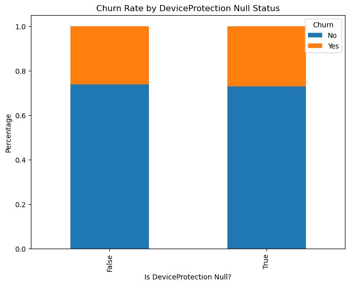
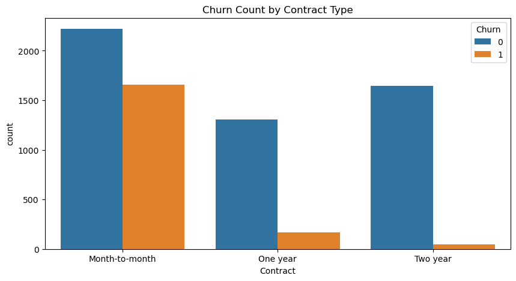
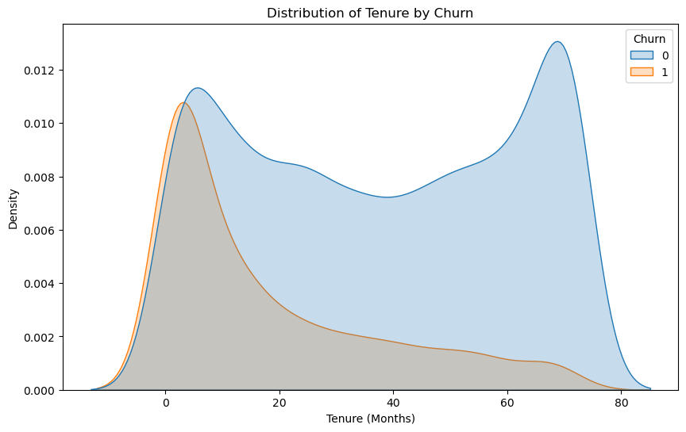
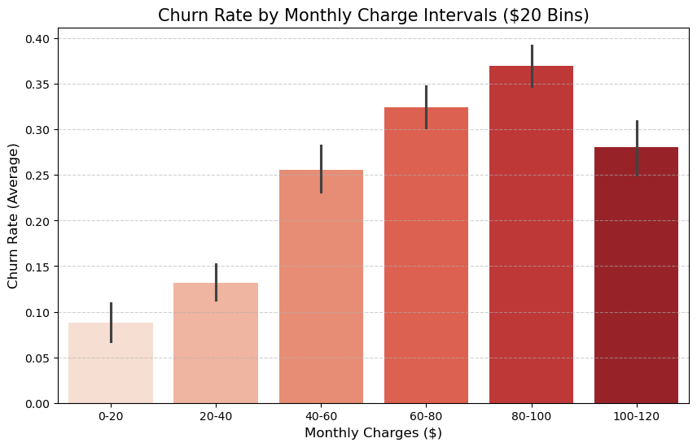
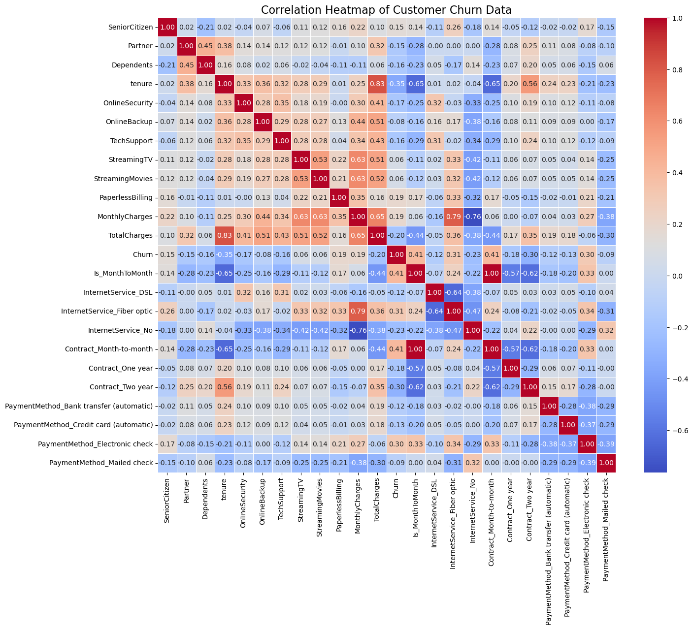

# 통신사 고객 이탈 데이터 분석


Kaggle의 Telco Customer Churn 데이터를 활용해 고객 이탈 패턴을 분석하고 유지 전략을 제안한 실습 프로젝트입니다.

신규 고객 유치 비용은 기존 고객 유지 비용보다 **5~25배** 더 높습니다.
이 분석은 이탈 징후를 데이터로 사전에 포착해 선제적 대응 전략을 수립하는 것을 목표로 합니다.

- 데이터 출처: [Kaggle - Telco Customer Churn](https://www.kaggle.com/datasets/blastchar/telco-customer-churn)
- 규모: 7,043명 고객, 21개 변수 (인구통계 / 서비스 이용 / 계약 정보)

[](https://colab.research.google.com/github/jjuuu999/hipython/blob/main/45_%ED%8C%8C%EC%9D%B4%EC%8D%AC%EB%8D%B0%EC%9D%B4%ED%84%B0%EB%B6%84%EC%84%9D_%EC%8B%A4%EC%8A%B5_%ED%86%B5%EC%8B%A0%EC%82%AC%EA%B3%A0%EA%B0%9D%EC%9D%B4%ED%83%88_%EB%B0%B0%ED%8F%AC.ipynb)

---

## 분석 흐름

```
데이터 확인 → EDA → 전처리 → 시각화 → 인사이트 도출
```

---

## EDA — 이탈 현황 파악

전체 고객 7,043명 중 **1,869명(26.5%)이 이탈**했습니다.

```python
df.groupby('Churn').size()
# No(유지): 5174   Yes(이탈): 1869
```

| 전체 고객 | 이탈 고객 | 유지 고객 | 이탈률 |
|-----------|-----------|-----------|--------|
| 7,043명 | 1,869명 | 5,174명 | 26.5% |

---

## 데이터 전처리

### 불필요한 컬럼 제거

```python
# 식별자 컬럼 제거
df_new = df.drop(columns='customerID')

# 이탈률 차이가 미미한 변별력 낮은 컬럼 제거
# (MultipleLines 3.7%, PhoneService 1.8%, gender 0.8%)
cols_to_drop = ['MultipleLines', 'PhoneService', 'Is_DP_Null', 'gender']
df_new.drop(columns=cols_to_drop, inplace=True)
```

### 결측치 처리

**DeviceProtection — 결측치 3,463개**

결측 여부가 이탈률에 영향을 주는지 먼저 시각화로 확인했습니다.

```python
df_new['Is_DP_Null'] = df_new['DeviceProtection'].isnull().astype(str)
null_churn_dist = df_new.groupby('Is_DP_Null')['Churn'].value_counts(normalize=True).unstack()
null_churn_dist.plot(kind='bar', stacked=True)
# 결측 여부와 무관하게 이탈 비율 약 3:1 동일 → 변수 제거
```



결측 여부와 무관하게 이탈 비율이 동일해 컬럼 전체를 제거했습니다.

**TotalCharges — 공백 문자 11개**

신규 가입(tenure=0) 고객의 TotalCharges가 공백으로 입력된 케이스였습니다.

```python
# 공백 확인 → tenure가 모두 0인 신규 고객
print(df_new[df_new['TotalCharges'] == ' ']['tenure'])

# 공백을 NaN으로 변환 후 0으로 대체
df_new['TotalCharges'] = pd.to_numeric(df_new['TotalCharges'], errors='coerce')
df_new['TotalCharges'] = df_new['TotalCharges'].fillna(0)
```

**Contract, PaymentMethod — 최빈값으로 대체**

```python
df_new['Contract']      = df_new['Contract'].fillna(df_new['Contract'].mode()[0])
df_new['PaymentMethod'] = df_new['PaymentMethod'].fillna(df_new['PaymentMethod'].mode()[0])
```

### 인코딩

```python
# Yes/No 이진 변수 → 0/1
binary_cols = ['Partner', 'Dependents', 'PaperlessBilling', 'Churn']
for col in binary_cols:
    df_new[col] = df_new[col].map({'Yes': 1, 'No': 0})

# 부가 서비스: Yes → 1, 나머지(No / No internet service) → 0
addon_cols = ['OnlineSecurity', 'OnlineBackup', 'TechSupport', 'StreamingTV', 'StreamingMovies']
for col in addon_cols:
    df_new[col] = df_new[col].apply(lambda x: 1 if x == 'Yes' else 0)
```

---

## 시각화 및 주요 발견

### 계약 유형별 이탈률

```python
sns.countplot(data=df_new, x='Contract', hue='Churn')
```



월 단위 계약 이탈률 **42.7%** — 2년 계약(2.8%) 대비 약 15배 높음

### 가입 기간 및 요금별 이탈 분포

```python
sns.kdeplot(data=df_new, x='tenure', hue='Churn', fill=True)
```



이탈은 **가입 초기 0~10개월**에 집중되며 20개월 이후 안정화됩니다.
월 요금 **$80~$100** 구간에서 이탈률 최고치(36.1%)를 기록했습니다.

### 고위험군 분석 — 가입 기간 × 월 요금

```python
sns.kdeplot(data=df_new, x='tenure', y='MonthlyCharges', hue='Churn', 
            fill=True, alpha=0.5, palette={0: 'blue', 1: 'red'})

plt.title('High-Risk Group Analysis: Tenure vs Monthly Charges', fontsize=15)
plt.xlabel('Tenure (Months)', fontsize=12)
plt.ylabel('Monthly Charges ($)', fontsize=12)
plt.grid(True, linestyle=':', alpha=0.5)
plt.show()
```



단기 가입(0~10개월) + 고요금($70 이상) 조합의 고객군에서 이탈이 가장 집중됩니다.

### 상관관계 히트맵

```python
df_corr = pd.get_dummies(df_new)
sns.heatmap(df_corr.corr(), annot=True, fmt='.2f', cmap='coolwarm')
```



Churn과 가장 높은 양의 상관성 → **Month-to-month 계약**
Churn과 가장 높은 음의 상관성 → **tenure(가입 기간)**


> 이탈 고객 평균 요금 **$74.4** vs 유지 고객 평균 요금 **$61.3**
